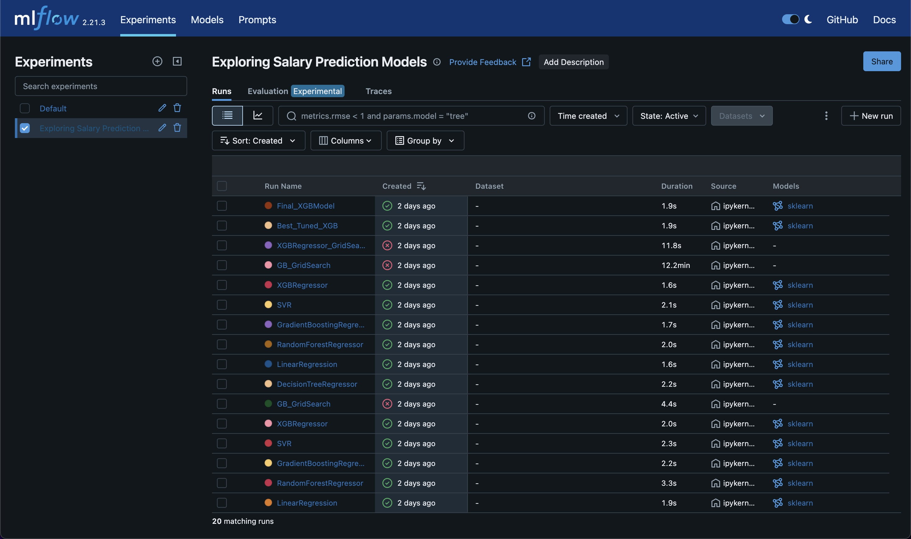
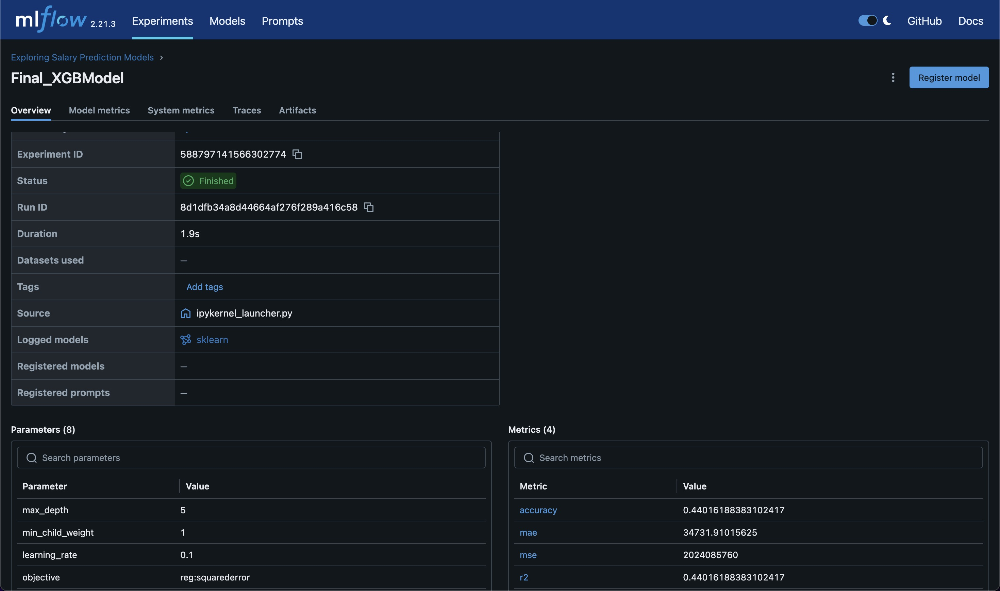
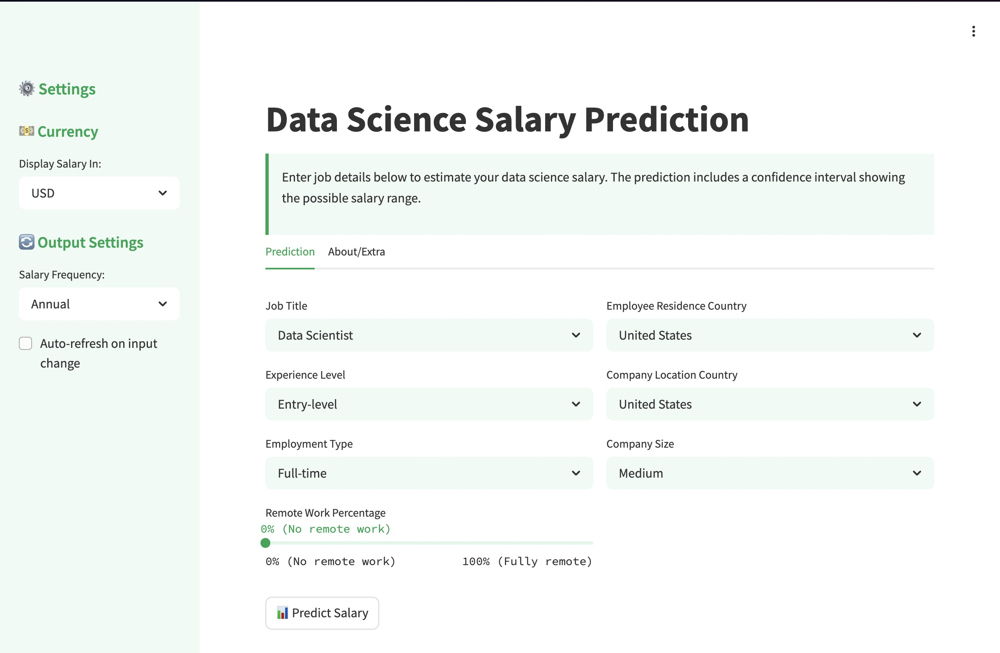
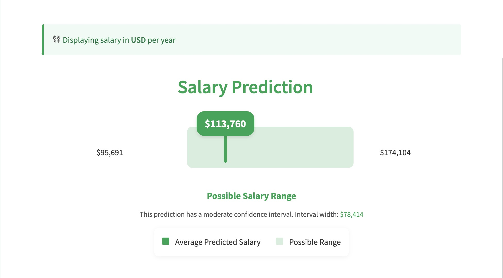
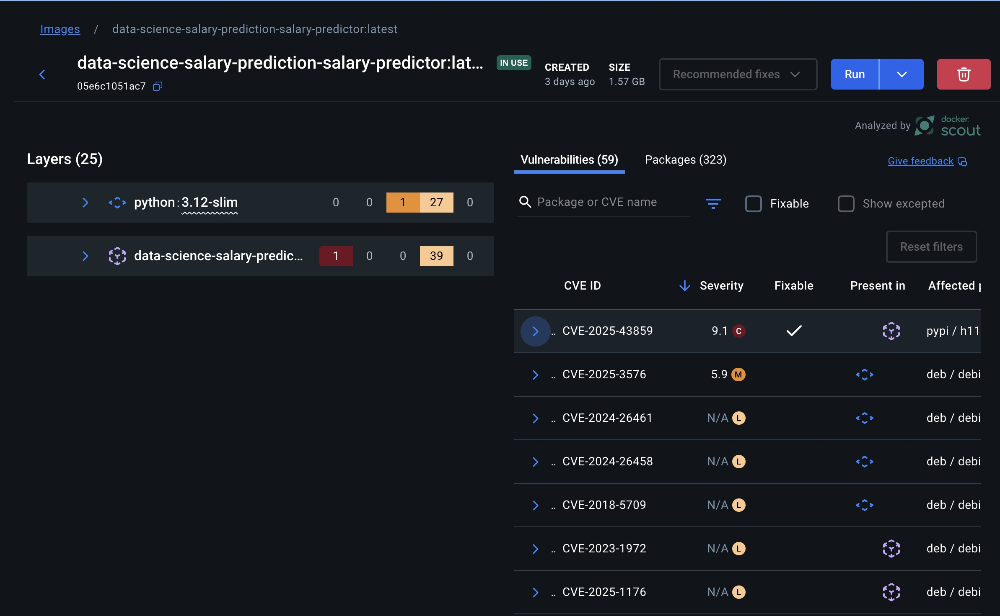

# Project Report: Data Science Salary Prediction

## Introduction

This report summarizes the components developed for the Data Science Salary Prediction project, based on the MLOps project outline, emphasizing visual evidence of the implemented features.

## Project Components

Based on the project codebase and documentation, the following components have been implemented:

1.  **Process Map:** The documented process for the project is visualized below:

    

2.  **Data Ingestion from Online Source:** The project utilizes data (`ds_salaries.csv`) sourced from a Kaggle dataset (link in `README.md`). The `eda/` notebooks detail the ingestion and preparation process, resulting in `data/encoded_data.csv`.

3.  **Data Repository and Model Repository:**
    *   The `data/` directory serves as the data repository, holding raw (`ds_salaries.csv`) and processed (`encoded_data.csv`) data.
    *   MLflow is integrated for model tracking and management, acting as the model repository. The MLflow UI provides an overview of different model runs and experiments:

        

4.  **Predictive Model:** An XGBoost model predicts salaries. Its development is documented in `docs/dev-model.md` and notebooks within `modeling/`. The final model is tracked and versioned within MLflow, as shown below:

    

5.  **Model Predictions (Deployment & Access):**
    *   A Streamlit application (`app.py`) provides an interface for users to input parameters and receive salary predictions. The UI allows selection of various job characteristics:

        

        Once parameters are submitted, the application displays the predicted salary:

        

    *   The application is containerized using Docker (`Dockerfile`, `docker-compose.yml`). The `docker-compose.yml` defines the service configuration:

        ```yaml
        services:
          salary-predictor:
            build:
              context: .
              dockerfile: Dockerfile
            ports:
              - "8501:8501"
            # ... other configurations ...
        ```
        
    *   The deployed application is made accessible to users via a public URL managed through a Cloudflare tunnel: [dss.kyllan.dev](https://dss.kyllan.dev).

6.  **Model Monitoring:** MLflow is implemented for tracking model experiments, parameters, and metrics during development, as visualized in the screenshots above.

7.  **Documentation:**
    *   **Model Process:** Documentation covering the data source, feature engineering, model selection (XGBoost), and performance is available in the main `README.md`, `docs/dev-model.md`, and associated notebooks in `eda/` and `modeling/`.
    *   **Security Risks & Mitigations:** Several potential security risks and existing mitigations should be noted:
        *   **Input Validation:** The risk of injection attacks is significantly reduced as the application relies on standard Streamlit components (e.g., dropdowns, sliders) for input, which handle their own validation, rather than using free-text fields.
        *   **Denial of Service (DoS):** While any public application can be a target, the use of a Cloudflare tunnel provides substantial, built-in protection against common DoS and DDoS attacks.
        *   **Model Evasion/Poisoning:** Although less likely for this specific application's purpose, adversarial attacks could potentially try to manipulate inputs (even dropdowns) to get misleading predictions. If a retraining pipeline existed, data poisoning would be a consideration.
        *   **Dependency Vulnerabilities:** Outdated or vulnerable packages listed in `requirements.txt` or present in the Docker base image remain a potential risk vector. Regular dependency scanning (e.g., using Docker Scout) is recommended. A recent scan highlighted a critical vulnerability:

            

            This vulnerability originates from a dependency within Streamlit itself. Addressing it would likely require changes upstream from Streamlit or migrating the application framework entirely.
        *   **Infrastructure Security:** The security of the underlying deployment server (VM, network configuration) and the Cloudflare account remains crucial for overall protection.

## Conclusion

The project delivers an end-to-end data science solution incorporating a documented process map (visualized above), data ingestion from an online source, data and model repositories (using local storage and visually confirmed MLflow integration), a trained predictive model tracked in MLflow, and a user-accessible Streamlit application (UI demonstrated above) deployed via Docker (configuration snippet included) and accessible at [dss.kyllan.dev](https://dss.kyllan.dev). The model development process, performance, and potential security risks (including identified dependency vulnerabilities and existing mitigations like Cloudflare DoS protection and Streamlit input handling) are documented.